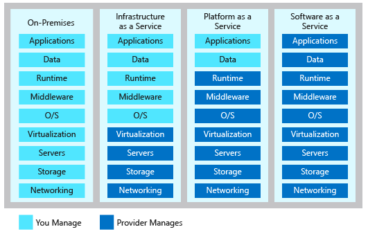

# Types

## Public cloud
- owned and maintained by cloud provider
- payed for used resources
- easy scalable
- no upfront costs
- redundancy
- geographic dispersity

## Private cloud
- owned, maintained by organisation
- pre exisiting enviroment
- legacy apps, which need the infrastructure
- data sovereignty and security
- Regulatory compliance / certification

## Hybrid Cloud
- mix beetween private and public cloud
- legacy apps and data can run in the organisation data center
  - modern applications, that have to scale can run in cloud an daccess private apps via VPN
- existing hardware investment
- regulatory requirements
- unique operating environment
- migration

# Service Models

## Infrastructure-as-a-service (IaaS) 
- provides instant computing infrastructure that you can provision and manage over the Internet.
## Platform as a service (PaaS) 
- provides ready-made development and deployment environments that you can use to deliver your own cloud services.
## Software as a service (SaaS) 
- delivers applications over the Internet as a web-based service.